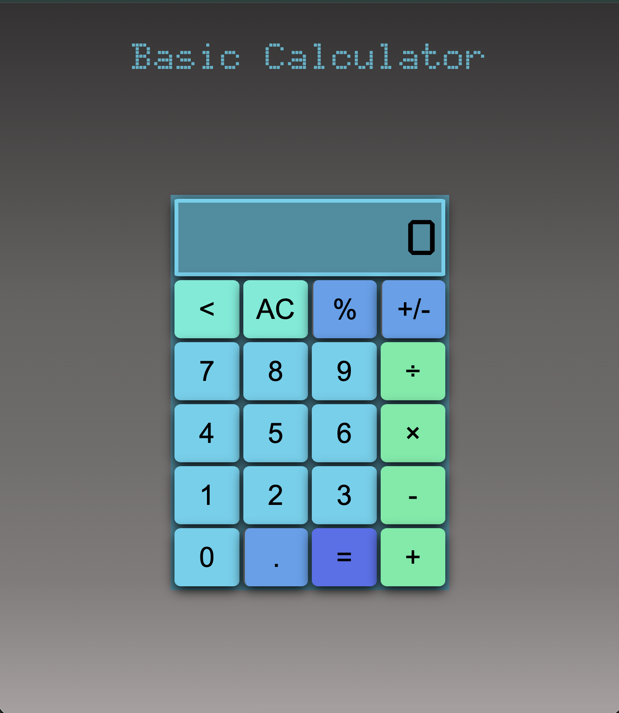

# JS-Calculator
A JavaScript calculator to work on reinforcing the basics of HTML, CSS, and JavaScript. It can perform basic operations and only do one operation at a time.
---

---
### Features
This calculator can perform all basic operations: add, subtract, multiply, divide. It can use floating point decimal numbers and percents. There is also a button to change the sign of a number (positive/negative). There is a delete button that will only modify the newest number the user has inserted. All of these functions are used by pressing buttons with the mouse. Numbers exceeding 8 digits will be converted into scientific notation.
---
### Technologies Used
- HTML
- CSS
- JavaScript
- Google Fonts
---
### How to Use
To use just open the index.html file in any browser or use live server. It works like any other calculator, and button presses/inputs can be done with the mouse.
---
### What I learned
For `CSS` I learned how a Grid works. Including fr units, grid-column: span, and figuring out how to structure it. Also, what the difference between id and class is, and implementing both of them. I used gradients, and Adobe color picker, so that the all the buttons complemented each other to have a structured color theme throughout the calculator. Finally, using box-shadow, and :hover to make the UI feel interactive.  
`JavaScript` is where I learned a lot. I learned how the DOM works and how to select and manipulate elements with getElementById and innerHtml. I implemented many event listeners and understood the difference between passing a function reference and calling a function directly. I looked into DOMContentLoaded and how JavaScript runs in the browser. Also, I learned the differences between JavaScript numbers and strings, converting them, and doing calculations with them. I messed around with scope and different implemented string methods. Finally, I implemented state management using boolean variables. 
---
### Future Improvements
- Adding a scroll to the display to view large numbers entirely
    - have dynamic font sizing
- be able to give input using the keyboard
- add a dropdown that switches calculators
- having different types of calculators: programming and scientific
- create a tab icon and have it show on browser tab
---